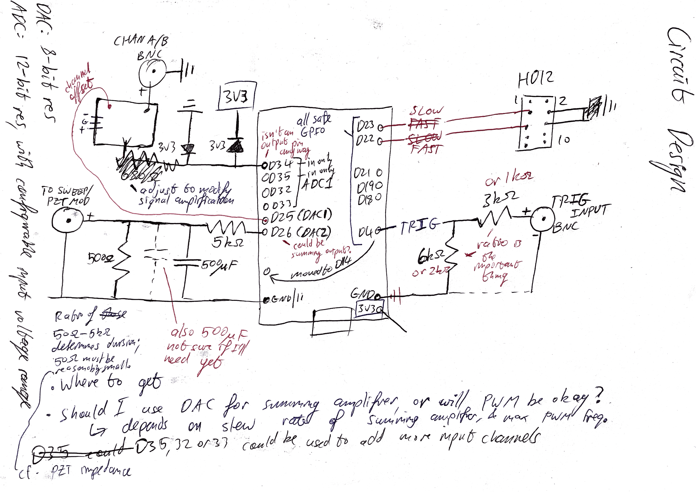

# ESP32 Remote Oscilloscope + MOGLabs DLC control

This project is a remote browser-based oscilloscope and controller intended for monitoring, toggling and adjusting the frequency lock on a MOGLabs Diode Laser Controller (DLC). An ESP32 development board interfaces with the DLC and hosts a dashboard webpage.

This README contains [Instructions](#instructions) for setting up and using the project as well as useful [Background information](#background). A list of [bugs and suggested improvements](#bugs-and-improvements) is at the end. The project was developed and tested using the PlatformIO Extension in VSCode, with a model 502 DLC and a DOIT ESP32 DEVKIT V1 development board.

## License
[GPLv3](LICENSE)

## Instructions
[Config](#program-configuration-and-upload) - [Circuitry and DLC](#hardware-connections-and-settings) - [Interface](#interface)
### Program configuration and upload
This section assumes you are using the PlatformIO extension in VSCode.

Specify project options by editing `config.json` (in `/data`). If connecting to an existing WiFi network (the default option), you must specify its `ssid` (network name) and `password`. If instead `host` is set to `true`, the ESP will host its own network (intended for testing purposes) with credentials `host_ssid` and `host_password`. `host_password` must contain at least 8 characters; otherwise hosting will fail. Note that the ESP32 only supports 2.4GHz WiFi (not 5G).

Other parameters are optional, with defaults and descriptions as shown below in **Example 2**.

**Example 1: minimal WiFi connection**
```
{
  "ssid": "MyWiFiNetwork",
  "password": "verysecurepassword",
}
```

**Example 2: all options**
```
{
  "name": "TestName",
  "host": false,
  "ssid": "MyWiFiNetwork",
  "password": "verysecurepassword",
  "host_ssid": "ESP32_Laser_Lock",
  "host_password": "laserlock",
  "host_channel": 1,
  "default_duration": 60,
  "default_resolution": 2,
  "default_ip": "192.168.1.1"
}
```

| Parameter | Description |
| --- | --- |
| `name` | Display name for the device |
| `host_channel` | If hosting, the WiFi channel used. |
| `default_duration` | Default length of a measurement packet (millisec), adopted on board startup. |
| `default_resolution` | Default time (ms) between consecutive samples in a measurement packet, adopted on startup. |
| `default_ip` | If available, the local IP address the ESP32 will adopt. Applies to both hosted and external networks. |

To **upload the project to the board**:
1. Connect the board to your computer via a cable.
2. Upload the filesystem to the board:
    - '*Build filesystem Image*' (in PlatformIO menu)
    - **Ensure all serial monitor connections with the board are closed**. PlatformIO does not do this automatically when uploading the filesystem (though it *does* when uploading the code in step 4)
    - '*Upload filesystem Image*' (in same menu)
3. '*Build*' (PlatformIO menu, or tick symbol in status bar)
4. '*Upload*' (PlatformIO menu, or rightwards arrow in status bar)

The program will restart each time the ESP is plugged in, code/filesystem is re-uploaded, or the RST button is pressed.

Open the serial monitor to see the board's local IP. You may need to reset the program (RST button) while the monitor is open for the message to display. If `default_ip` is specified (and was successfully adopted), you can skip this step.

Connecting to the board's IP in a browser (e.g. `http://192.168.1.1`) while on the same network will open the [Interface](#interface).

### Hardware connections and settings
This section assumes you already have a laser-locking setup using the MOGLabs DLC. For information about laser locking and the DLC, see [Background](#background).

> Some of this circuitry is **provisional**; in particular, more board protection and a reduction of noise in the output frequency control signal are required.

Safe input voltages for the board's pins are 0-3.3V, and is it **not** tolerant of voltages outside this range. Be careful to keep the DLC and ESP32 ground voltages compatible.

The ESP32 interacts with the DLC via *two input signals*:
- Analog INPUT SIGNAL (to be measured). We add an offset and protection to keep this in the safe voltage range.
- Digital TRIGGER signal from the DLC. This is a +5V signal which we divide down to a board-safe voltage.

and *three output signals*:
- Digital (TTL) SLOW lock control signal. Easily connected.
- Digital (TTL) FAST lock control signal. Easily connected.
- Analog FREQUENCY offset signal. This is divided down to prevent large, abrupt changes.

Be aware that external frequency control via the offset signal will require soldering an additional resistor into the board (see [Frequency control](#frequency-control)).

For reference, below are the DLC panels (credit: the [DLC manual](https://www.moglabs.com/products/laser-electronics/diode-laser-controller)) and a rough sketch of the (provisional) circuit. The rest of this section explains the circuit setup. Please read carefully.

**Note**: a proper circuit diagram (and Fritzing diagram) should eventually go here.

**Front panel**


**Rear panel**


**Circuit**


#### **Power**
The DLC has an IEC output (rear panel, second from the left), which is a direct connection to the DLC's input power (after the mains filter) and can be used to power the ESP32 using an IEC cable and 12V power adapter. This is convenient and ensures the ESP32 shares the same ground as the DLC.

The board has two ground pins.

#### **SLOW and FAST**
Digital control of the DLC is via the internal HD12 header, which is located as shown below. **Do not** confuse it with the similar-looking header nearby. The ESP's digital pin voltages are compatible with the HD12 header, and can be connected directly as per the table below.

| Board pin | HD12 pin(s) |
| --- | --- |
| D23 | 3 |
| D22 | 5 |
| GND | 4, 6 |

Ensure that the sweep range is set appropriately, and that the front-panel LOCK and FAST switches are **off** so that these can be enabled remotely.


#### **TRIGGER**
The MOGLabs DLC trigger signal output (TRIG on rear panel) fires a +5V rising edge (i.e. 0V to 5V) at the trigger point of the sweep, i.e. the *centre* if using the DLC's default (internal) sweep.

To achieve a board-safe voltage, the trigger signal voltage is reduced to *two thirds* of its original 5V voltage using two series resistors with resistance ratio 1:2 (e.g. 1kΩ:2kΩ), and connecting pin D4 to the voltage across the latter.

#### **INPUT SIGNAL**
The ESP32 can be used to monitor an arbitrary signal, but is intended for measuring either the DLC's photodiode input or the resulting error signal, via either the Channel A or B output. The measurement circuitry has not yet been fully implemented or tested.

At minimum, connecting two 3.3V diodes in the reverse direction from the input rail to the board's ground pin and 3.3V (3v3) pin will clip the input signal to a safe voltage range. This is sufficient to monitor the photodiode signal, which may be offset arbitrarily to lie within the appropriate range. However, correct locking requires the DLC's error signal to be centred at zero. It will therefore contain negative voltages, and therefore requires an additional offset before measurement to be within the board's safe range. This is achieved with a (not-yet-implemented) summing amplifier.

The photodiode input offset and error signal offset can be adjusted respectively using the INPUT and ERROR OFFSET dials on the DLC's front panel. Typical output signals from the DLC have a peak-to-peak span smaller than 3.3V (so an offset is sufficient to fit them within the board's voltage range), but further scaling could be applied.

#### **FREQUENCY CONTROL**
Depending on which DIP switches are active, the SWEEP/PZT MOD input (rear panel) allows replacement of either the sweep signal (DIP 9), error signal (DIP 15) or direct piezo control voltage ('STACK') (DIP 13) with an external signal. The fourth option, **used in this project**, is to instead add a resistor (~5kΩ, size 0603) at location R113 (see the DLC manual), while leaving the aforementioned DIP switches OFF. This *adds* the SWEEP/PZT MOD input to the existing laser piezo signal, and seems to be the only way to externally adjust the laser's offset frequency while making use of the DLC's (well-built) locking circuitry.

To implement frequency control, resistor R113 is therefore added. An analog offset signal from the ESP32 is then connected to the SWEEP/PZT MOD input as per the circuit diagram.

Currently, the offset signal is produced from one of the board's inbuilt digital-to-analog converters (DACs): pin D26. The SWEEP/PZT MOD voltage is amplified by a large factor (48x) before reaching the piezo; to achieve finer control, we first divide the D26 output voltage by a factor of 11 using a 5kΩ-500Ω resistor pair. These resistances may be varied, but the latter should remain below 500Ω; if it becomes comparable to the SWEEP input impedance of 5kΩ, it will no longer determine the voltage division factor.

The ESP32's WiFi module causes periodic spikes in power usage, which are not completely mitigated by the board's inbuilt voltage regulator. This adds enough noise to the DAC output to prevent successful locking. I am in the process of testing whether adding bypass capactors to the D26 output is sufficient to remove this noise; it does not seem likely, and I plan to instead introduce an external DAC controlled via Serial Peripheral Interface (SPI).

### Interface
Connecting to the board's IP in a browser should display the page below. If you didn't set the IP in `config.json`, you can list the devices on the local network using `arp -a` in a terminal, or check the IP by restarting the ESP32 while connected to the serial monitor.

Only one user is allowed to connect at a time, to prevent conflicting commands.

Controls for the DLC, the ESP32, and the browser display are split into three separate panels.


#### DLC Control
The top panel has switches for toggling the SLOW and FAST lock. These switches are subject to a cooldown, and will also only change appearance once the ESP has confirmed the command was successful.

The 'Frequency Offset' slider controls the external voltage to the piezo. The displayed number is arbitrary.

#### Sampling settings
Signal measurements are sent from the board to the browser in groups. The RESOLUTION and DURATION sliders respectively control the time between individual measurements and the size of each group sent to the browser.

#### Display settings
These affect how the signal is displayed in the browser. Check 'Remember' to remember these settings.

| Slider| Function |
| --- | --- |
| DIV | Time period represented by each horizontal interval on the display. (i.e. horizontal scaling) |
| POSITION | Horizontal position of the trigger point in the signal, marked by the yellow indicator. |
| PERSISTENCE | How quickly previous trigger signals fade from the screen. |
| LINE | The line thickness. |

## Background
This section explains useful background on laser operation and the MOGLabs DLC, as well as summarising relevant details about the ESP32 and giving an overview of how the program works.

### Lasers (motivation and operation)
In various applications we would like to 'lock' the frequency of a laser to a specific atomic transition frequency, either because these are physically constant and known to high precision or because we are working with that particular transition.

The output power and frequency of an external-cavity diode laser (ECDL) (TODO: useful reference here) are controlled primarily (though to differing extents) by three factors:

1. Current injected to the diode
2. Temperature
3. Cavity length (controlled by piezo voltage).

An ECDL internally permits light to (co)exist at a discrete set of frequencies ('modes') determined by the length of the cavity. This light bounces back and forth through a 'gain medium', which repeatedly amplifies it (up to the limit of power provided by the injection current). On each trip, a small amount exits the cavity. The diagram below is an example of frequency-dependent gain (black) affecting different modes (red) (image credit: [this stackexchange answer](https://physics.stackexchange.com/questions/355223/laser-gain-curve) under the [CC BY-SA 4.0 license](https://creativecommons.org/licenses/by-sa/4.0/)).


At a given temperature and injection current, the gain medium amplifies different frequencies by different amounts, known as a gain curve. When 'lasing' (i.e. sufficiently high current), the most strongly-amplified of the allowed modes will quickly dominate, producing a single-frequency output (provided this amplification is enough to overcome losses).

Even with constant current, temperature and cavity length, the laser frequency tends to drift, which is mitigated using feedback. However, if two modes have similar amplification, the dominant one can switch erratically ('mode hopping') with a corresponding distinct jump in frequency. These jumps typically can't be remedied by feedback, requiring the laser to be re-locked. The aim of this project is to allow this re-locking to be performed remotely.

### Frequency locking (Saturated absorption spectroscopy)
To produce an error signal, we make use of the fact that an atom will only absorb light that is near a transition, roughly within a linewidth (i.e. ~inversely proportional to the lifetime of the corresponding state). Linewidths vary between kHz and GHz.

[ Diagram: vapour cell with counterpropagating beams ]

Suppose a laser passes through a gas. The *apparent* frequency of the laser depends on the velocity of an atom (the Doppler effect). Since the atoms have a range of velocities, the laser will be absorbed in rough proportion to the number of atoms at the corresponding velocity, so the range of absorbed frequencies is 'Doppler-broadened' and the output intensity varies on the order of GHz.

If we reflect the laser back through the cell, it will now excite (i.e. be absorbed by) atoms of the *opposite* velocity, reducing the intensity again. This will not occur, however, if these atoms were *already* excited by the forward beam, i.e. if the beam is exactly on resonance with the zero-velocty atoms. So, we get a small dip in absorption when at the transition frequency.

[ TODO: diagram of doppler-broadened peak and saturation dip]

[ TODO: diagram of Rb85 absorption spectrum and error signal]

We can use the absorption dip as a reference point via either *AC* or *DC* locking. In both cases, we first produce an *error signal* whose voltage indicates the sign and size of any frequency drift, being zero at the reference point. Any error is then corrected via a feedback signal to the laser.

DC locking uses the absorption signal itself (as measured by the photodiode) as the error signal, by applying a voltage offset so that the signal passes zero on the side of the absorption peak. However, this easily becomes unlocked as the laser power drifts relative to the reference voltage.

AC is more reliable and allows you to lock exactly to the peak of a signal. This is done by rapidly shifting the signal from side to side, by deliberately modulating (dithering, i.e. rapidly oscillating) either the laser frequency (via the injection current) or the atomic resonance frequency (via a magnetic field). The MOGLabs DLC supports both methods, but in this case we used the former. Passing the modulated signal through a lock-in amplifier yields the derivative of the absorption spectrum, which passes through zero at the centre of the peak.


### MOGLabs Diode Laser Controller
This section is a reference for how the DLC works, convering information relevant to the design and understanding of the project. It summarises parts of the MOGLabs DLC manual (description and manual [here](https://www.moglabs.com/products/laser-electronics/diode-laser-controller)) and my own experience. As an example of using the DLC, the setup used to develop this project is described in the next section.

The DLC controls all three of the ECDL's piezo voltage (cavity length), temperature and injection current. The voltage applied to the piezo is known as the STACK (some lasers have a second piezo, *DISC*, which can also be controlled - I ignore that here.). At any given time, the DLC is either SCANning or LOCKing the laser frequency.

The voltage supplied to STACK ranges from 0-120V. When scanning, this voltage is adjusted according to the DLC's *sweep signal*, which has a range of 0-2.5V. The width of the scan (corresponding with full 0-2.5V range) is controlled by the SPAN dial and cannot be controlled externally. The DLC's trigger fires when the sweep signal crosses 1.25V, and when locking is activated the laser is first moved to this point before locking to the nearest zero-crossing of the error signal. Offsets to the input signal and error signal are adjusted using the INPUT OFFSET and ERROR OFFSET dials, respectively.

The DLC can either generate its own internal sweep signal, or use an *external* signal input to SWEEP/PZT MOD. The direction (polarity) of the internal sweep can be chosen using DIP switch 11, and its frequency can be varied between 4Hz-70Hz using the *fsweep* front panel trimpot. Diagrams of the internal sweep and corresponding trigger output are provided in the manual. The sweep sawtooth is illustrative only; the DLC doesn't produce a sawtooth with perfectly vertical edges; they actually have a slight slope, to prevent the piezo from snapping back into place too forcefully (which creates a rattling sound). If this still happens, you may need to reduce the sweep frequency (fsweep trimpot) or SPAN.

The piezo offset (i.e. laser frequency) at the lock point is determined by the FREQUENCY dial. In particular, it is *not* affected by the use of an external sweep signal, which is only useful for controlling the speed, shape and (potentially asymmetric) width of the frequency path up to the maximum width set by SPAN. The lock frequency can only be adjusted externally using resistor R113, as described previously.

To limit mode-hopping while scanning, the diode current can be 'biased' to automatically adjust itself; this is enabled using DIP switch 4, with the direction and extent of adjustment controlled by the BIAS front trimpot.

The DLC provides feedback to the laser via:

1. The (relatively SLOW) piezo - for larger, slower drifts
2. The (comparably FAST) injection current - for small, rapid frequency fluctuations.

Each feedback is enabled by the corresponding switch (or digital control), and the direction can be reversed using DIP switch 10. The choice of AC or DC locking is controlled by DIP 7. The DLC provides an optional 250kHz modulation (switch OFF/MOD on front panel), either as an output (for e.g. dithering the atomic resonance) or directly to the laser current (see DIP switches); this is intended to aid AC locking.

A DIP switch is just a small, manual switch. Below is a reference; selections used in this project are in bold, and a brief explanation is on the right.

| DIP Switch | Off | On | Relevance |
| --- | --- | --- | --- |
|1 | **DISC fixed** | DISC ON| Our laser doesn't have DISC |
|2 |STACK fixed| **STACK ON**| Enables control of the piezo |
|3 |Current dither OFF| **Current dither ON** | Enables *laser current* modulation when OFF/MOD is enabled |
|4 |Current bias OFF| **Current bias ON**| Enables BIAS, to avoid mode hopping|
|5 |**Internal error**| External error| We use the DLC's generated error signal
|6 |**External current mod OFF**| External current mod ON| Leave the DLC to do its thing
|7 |**AC lock**| DC lock| AC locking is more reliable
|8 |**Single photodiode**| Dual photodiode| Measuring direct intensity or the difference of two intensities, using the MOGLabs photodiode.
|9 |**Sweep internal**| Sweep external| Internal sweep works well, and SWEEP/PZT mod is needed for electronically adjusting the frequency offset
|10| STACK feedback –| STACK feedback +| Depends on your setup
|11| STACK sweep +| STACK sweep –| Depends on your setup
|12| **AC current feedback** | DC current feedback| FAST feedback should usually be AC no matter what
|13| **STACK internal**| STACK external| We want the DLC to control STACK, not us.
|14| DISC internal| DISC external| Irrelevant if no DISC.
|15| Default| External slow error| See manual
| 16 | See manual.


HD12 digital control header:

| Pin | Signal |
| --- | --- |
|1 | Laser ON (low: off) |
|3 | Slow Lock (low: Sweep) |
| 5 | Fast Lock |
| 7 | Hold |
| 9 | +5V |

Pins 2,4,6,8,10 are ground. 

This section is **incomplete** and will be extended.

### ESP32
The ESP32 is a system-on-chip (SoC) with built-in WiFi. For ease of use, this is almost always mounted on a *development board*, which provides easy pin access and various other useful components (e.g. ADC, voltage regulation). The layout and capabilities of these boards vary, but a common one (as used in this project) is the ESP32 DEVKIT V1.

*Last Minute Engineers* (*LME*) provides an exceptional [introduction](https://lastminuteengineers.com/esp32-arduino-ide-tutorial/) and [pin reference](https://lastminuteengineers.com/esp32-pinout-reference/) for this board (as well as the ESP8266). Their tutorial uses the Arduino IDE, while this project was developed using the PlatformIO IDE for VSCode (including the instructions in this README). An excellent video tutorial for PlatformIO+VSCode can be found [here](https://www.youtube.com/watch?v=JmvMvIphMnY). The code itself uses the ESP32 Arduino framework ([documentation here](https://espressif-docs.readthedocs-hosted.com/projects/arduino-esp32/en/latest/index.html)).

The *Last Minute Engineers* pages also link to their tutorials on ESP web servers and GPIO interrupts, both of which are used in this project. Detailed specs can be found in the [official ESP32 datasheet](https://www.espressif.com/sites/default/files/documentation/esp32_datasheet_en.pdf). Below is the pin reference (note GPIO stands for General Purpose Input Output):


Additionally, note that not all pins are safe to use; a table is contained in the *LME* pin reference page.

The ESP32 has two analog-to-digital converters (ADCs), which together can read analogue inputs from fifteen pins; however, ADC2 cannot be used while WiFi is in use, and so the analog input pins for this project have been chosen from those available to ADC1.

ESP32 also has [a digital-to-analog converter](https://docs.espressif.com/projects/esp-idf/en/latest/esp32/api-reference/peripherals/dac.html) (DAC), which was not sufficient for this project.

The ESP32 only operates on 2.4GHz WiFi band (not 5.8GHz).


### Software overview
This section is in progress.


## Bugs and improvements

### Known bugs
- (Serial monitor) `ERROR: Too many messages queued`. The ESP32 has a message queue limit of 16 and any others will just be discarded. When the samplinf duration is small it is unable to flush the queue frequently enough.
- (Serial monitor) `open(): /littlefs/file does not exist`
  - this is a meaningless error, and to get rid of it you have to modify `ESPAsyncWebServer/src/WebHandlers.cpp` 
  - See https://github.com/lorol/LITTLEFS/issues/2

### TODO
- Improved code comments
- Limit total amount of stored data
- Finalise and update circuit diagram. Add a schematic and real implementation photo.
- Look into uploading the config file Over-The-Air.
- External DAC with control via SPI (for noise mitigation).
- Vertical DIV scaling

### Suggested improvements
- Mobile-friendly webpage (cf. `@media-query`)
- Optional user authentication
- Automatic mode-hop detection and re-locking
- Multi-channel display (user-chosen subset of ADC2-enabled pins)
- Test suite
- Input modes: continuous, on-request, single trigger
- Highlight clipped sections of the signal in red
- Button to remotely restart the ESP32 and/or restore default measurement settings.
- Cookies for display settings don't seem to be respected when the board restarts.
- Interface information
  - Warnings/errors from the ESP
  - Websocket connection status
  - Actual measurement resolution of most recent packet
- README
  - Serial monitor error message reference