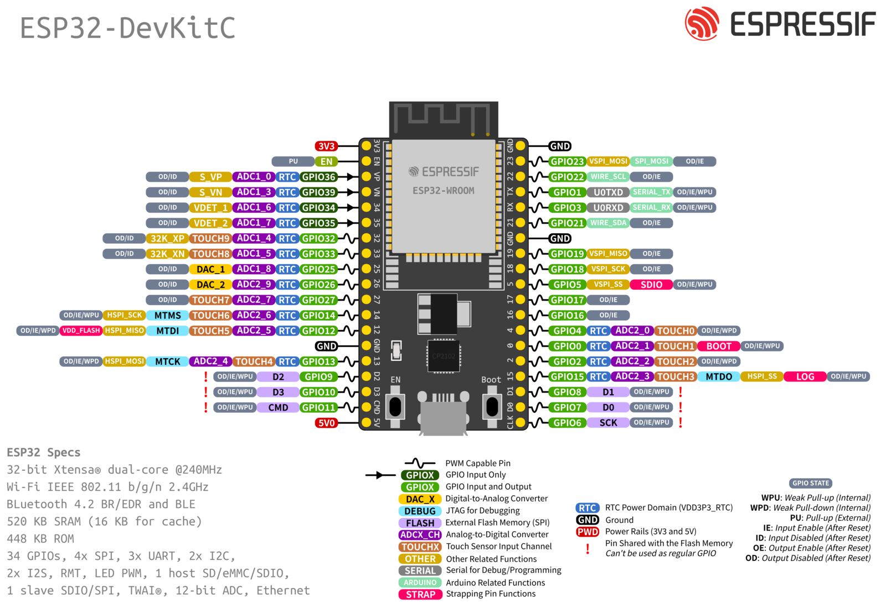

# ESP32 Remote Oscilloscope + MOGLabs DLC control

This project is a remote browser-based oscilloscope and controller intended for monitoring, toggling and adjusting the frequency lock on a MOGLabs Diode Laser Controller (DLC). An ESP32 development board interfaces with the DLC and hosts a dashboard webpage.

This README contains [Instructions](#instructions) for setting up and using the project as well as useful [Background information](#background). A list of [bugs and suggested improvements](#bugs-and-improvements) is at the end. The project was developed and tested using the PlatformIO Extension in VSCode, with a model 502 DLC. It requires an ESP32-DevkitC development board (see [specs, board comparison & resources](https://www.espressif.com/en/products/devkits/esp32-devkitc)), and should work with either WROVER or WROOM versions. It was tested with the ESP32-DevKitCVE V4 board, which has a WROVER module.

## License
[GPLv3](LICENSE)

## Repository structure
Branches: currently just `esp`. Branches for other microcontrollers might be useful in future.

PlatformIO:
- `src/main.cpp`: ESP32 code.
- `data/`: files stored on the ESP32 flash memory. Contains the webpage + `config.json`.
- `platformio.ini`: PlatformIO project config.

Hardware:
- `board-design/`: TODO
- `enclosure/`: FreeCAD files for the 3D-printable housing.

Other:
- `.vscode`: recommended extensions
- `assets/`: images for this README.


## Instructions
[Software config](#program-configuration-and-upload) - [Hardware](#hardware-connections-and-settings) - [Browser interface](#interface)

### Program configuration and upload
This section assumes you are using the PlatformIO extension in VSCode.

Specify project options by editing `config.json` (in `/data`). If connecting to an existing WiFi network (the default option), you must specify its `ssid` (network name) and `password`. If instead `host` is set to `true`, the ESP will host its own network (intended for testing purposes) with credentials `host_ssid` and `host_password`. `host_password` must contain at least 8 characters; otherwise hosting will fail. Note that the ESP32 only supports 2.4GHz WiFi (not 5G).

Other parameters are optional, with defaults and descriptions as shown below in **Example 2**.

**Example 1: minimal WiFi connection**
```
{
  "ssid": "MyWiFiNetwork",
  "password": "verysecurepassword",
}
```

**Example 2: all options**
```
{
  "name": "TestName",
  "host": false,
  "ssid": "MyWiFiNetwork",
  "password": "verysecurepassword",
  "host_ssid": "ESP32_Laser_Lock",
  "host_password": "laserlock",
  "host_channel": 1,
  "default_duration": 60,
  "default_resolution": 2,
  "default_ip": "192.168.1.1"
}
```

| Parameter | Description |
| --- | --- |
| `name` | Display name for the device |
| `host_channel` | If hosting, the WiFi channel used. |
| `default_duration` | Default length of a measurement packet (millisec), adopted on board startup. |
| `default_resolution` | Default time (ms) between consecutive samples in a measurement packet, adopted on startup. |
| `default_ip` | If available, the local IP address the ESP32 will adopt. Applies to both hosted and external networks. |

To **upload the project to the board**:
1. Connect the board to your computer via a cable.
2. Upload the filesystem to the board:
    - '*Build filesystem Image*' (in PlatformIO menu)
    - **Ensure all serial monitor connections with the board are closed**. PlatformIO does not do this automatically when uploading the filesystem (though it *does* when uploading the code in step 4)
    - '*Upload filesystem Image*' (in same menu)
3. '*Build*' (PlatformIO menu, or tick symbol in status bar)
4. '*Upload*' (PlatformIO menu, or rightwards arrow in status bar)

The program will restart each time the ESP is plugged in, code/filesystem is re-uploaded, or the RST button is pressed.

Open the serial monitor to see the board's local IP. You may need to reset the program (RST button) while the monitor is open for the message to display. If `default_ip` is specified (and was successfully adopted), you can skip this step.

Connecting to the board's IP in a browser (e.g. `http://192.168.1.1`) while on the same network will open the [Interface](#interface).


### Hardware
This section assumes you already have a laser-locking setup using the MOGLabs DLC. For information about laser locking and the DLC, see [Background](#background).

#### Overview
The MOGLabs DLC contains fast, robust analog control circuitry for locking the laser frequency. The point of this project is to allow the lock to be acquired via microcontroller control of the DLC, while leaving the DLC to handle the actual locking process.

The project currently has three inputs and three outputs. The photodiode , error and trigger (digital) signals from the DLC are input to the board and transmitted to the remote user interface. The board outputs two digital (TTL) control signals to enable/disable the FAST and SLOW lock, and an analogue signal (via external DAC) to adjust the laser's frequency offset. More detailed reasoning behind the electronic design is explained in [Hardware design](#hardware-design).

The next section contains some guidance for putting together the PCB. The ESP32 board can be soldered to the PCB directly for the smallest possible footprint, but it is much more flexible to attach it via additional male and female headers. The external frequency offset voltages used in this project also require soldering an additional resistor into the DLC (see [Connecting to the Diode Laser Controller](#connecting-to-the-diode-laser-controller)). 

Part numbers and quantities for two PCBs are specified in `board-design/moglabs-remote-locking-board.txt` for the DigiKey electronics distributor, which can be imported directly into a DigiKey cart. Auxiliary parts (headers + DLC resistor) are similarly specified in `board-design/auxiliary-parts.txt`. An optional 3D-printable housing for the project can be found under `enclosure/`. 

Electronic design was done in KiCAD 6, and the (optional) enclosure was generated with FreeCAD 0.20.2.


#### Printed Circuit Board
Relevant files are in `/board-design`. Gerber files for manufacturing the PCB can be found in `generated.zip`, and PCB circuit and layout schematics (`.pdf`) are under `plots/`.

```
board-design/
|-- generated.zip
|-- plots/
  |-- moglabs-remote-locking-board.pdf
  |-- moglabs-remote-locking-board.pcb
|-- moglabs-remote-locking-board.txt
|-- auxiliary-parts.txt
|-- ...
```

This section briefly describes the circuit, shown below. For more details, see `board-design/README.md`.

Left: input for the error signal ('Lock'), photodiode signal ('PD') and trigger. A 1.5V offset is added to the (bipolar) error signal to make it positive, and both Lock and PD voltages are clipped to remain within the board's 0-3.3V pin range. The DLC trigger is +5V, which is divided down accordingly.

Bottom left: power regulator to introduce +5V and -5V VDD and VSS rails from the board's 5V power pin.

Right: analog frequency-offset output signal (J6) controlled by an external DAC (U4) and dual opamp (U3). The DAC output is divided down considerably, as a 1V adjustment to PZT MOD corresponds with about a third of the piezo's (i.e. frequency) range. A variable resistor gives additional control over the output voltage range.


A reference table is below. More info in the linked datasheets.

Terminology:
- 8-SOIC is a component shell size/type (comonly opamps, dacs)
- "Example parts" are the ones used in the tested project
- DAC: digital-to-analogue converter
- SPI: Serial Peripheral Interface
- SMD: Surface-mounted device

| Requirement / Part description | Example part | PCB Locations | Total Qty | Notes |
| --- | --- | --- | --- | --- |
| 12-Bit single-output DAC with SPI and internal voltage reference (2.048V/4.096V) | [MCP4821](https://www.microchip.com/en-us/product/MCP4821) | U... | 
| 56 kOhm SMD resistor | ... | ... | ... | ... |
| ... | ... | ... | ... | ... |


Optional headers for mounting the ESP32 devkit on the PCB:
| Description | Example part | PCB Locations | Total Qty | Notes |
| --- | --- | --- | --- | --- |
| 19-position 2.54mm female header | PPTC191LFBN-RC | J7/J8 (not marked) | 2 |  |
| 19-position male header for ESP32 | 2057-PH1-19-UA-ND | On ESP32 | 2 | Likely included with ESP32 devkit |


#### Tests
- TODO


#### Connecting to the Diode laser controller
Take care when connecting to the DLC, particularly to avoid shorting the digital control pins. Ensure the internal DIP switch settings of the DLC are set appropriately (e.g. as in [Moglabs Diode Laser Controller](#moglabs-diode-laser-controller)). For reference, at the end of this section are the DLC panels (from the [DLC manual](https://www.moglabs.com/products/laser-electronics/diode-laser-controller)) and the location of the HD12 header.


##### **POWER**
The board can be powered via the micro-USB connector (5-12V) or the PCB's J1 two-pin header (5V).

The DLC has an IEC output (rear panel, second from the left), which is a direct connection to the DLC's input power (after the mains filter) and can be used to power the ESP32 using an IEC cable and 12V power adapter. This is convenient and ensures the ESP32 shares the same ground as the DLC.

Safe input voltages for the board's pins are 0-3.3V, and is it **not** tolerant of voltages outside this range. Be careful to keep the DLC and ESP32 ground voltages compatible.


##### **SLOW and FAST**
Digital control of the DLC is via the internal HD12 header, which is located as shown below. **Do not** confuse it with the similar-looking header nearby. The ESP's digital pin voltages are compatible with the HD12 header and can be connected directly as per the table below.

| Board pin | HD12 pin(s) |
| --- | --- |
| GPIO14 | 3 |
| GPIO4 | 5 |
| GND | 4, 6 |

Ensure that the sweep range is set appropriately, and that the front-panel LOCK and FAST switches are **off** so that these can be enabled remotely.

##### **TRIGGER**
The MOGLabs DLC trigger signal output (TRIG on rear panel) fires a +5V rising edge (i.e. 0V to 5V) at the trigger point of the sweep, i.e. the *centre* if using the DLC's default (internal) sweep. This can be safely connected to the appropriate BNC input on the PCB.


##### **INPUT SIGNALS**
Set the CHAN A and CHAN B selector dials to (photodiode) Input and (feedback) Error respectively; note that both channels can output the photodiode, but only CHANNEL B can output the error signal. Connect these to their respective PCB inputs.

The photodiode input offset and error signal offset can be adjusted respectively using the INPUT and ERROR OFFSET dials on the DLC's front panel. The photodiode should be in the range 0-3.3V, and the error centred for locking (i.e. about zero).

##### **FREQUENCY CONTROL**
Test the frequency control output (J6) before connecting, to ensure it is within the range +/- 0.2V. Before connecting, a 5kΩ resistor must be added at location R113 on the DLC's circuit board to allow adding an external frequency voltage offset.

| Description | Example part | **DLC** location | Total Qty |
| --- | --- | --- | --- |
| 5kΩ size 0603 SMD resistor | RMCF0603JT5K10 | R113 | 1 |

Once this is added, connect J6 via BNC to the DLC's SWEEP/PZT MOD input.


##### Reference images

**Location of HD12 Header**


**Front DLC panel**


**Rear DLC panel**


### Interface
Connecting to the board's IP in a browser should display the page below. If you didn't set the IP in `config.json`, you can list the devices on the local network using `arp -a` in a terminal, or check the IP by restarting the ESP32 while connected to the serial monitor.

Only one user is allowed to connect at a time, to prevent conflicting commands.

Controls for the DLC, the ESP32, and the browser display are split into three separate panels.


#### DLC Control
The top panel has switches for toggling the SLOW and FAST lock. These switches are subject to a cooldown, and will also only change appearance once the ESP has confirmed the command was successful.

The 'Frequency Offset' slider controls the external voltage to the piezo. The displayed number is arbitrary.

#### Sampling settings
Signal measurements are sent from the board to the browser in groups. The RESOLUTION and DURATION sliders respectively control the time between individual measurements and the size of each group sent to the browser.

#### Display settings
These affect how the signal is displayed in the browser. Check 'Remember' to remember these settings.

| Slider| Function |
| --- | --- |
| DIV | Time period represented by each horizontal interval on the display. (i.e. horizontal scaling) |
| POSITION | Horizontal position of the trigger point in the signal, marked by the yellow indicator. |
| PERSISTENCE | How quickly previous trigger signals fade from the screen. |
| LINE | The line thickness. |


## Background
This section explains useful background on laser operation and the MOGLabs DLC, as well as summarising relevant details about the ESP32 and giving an overview of how the program works.

### Lasers (motivation and operation)
In various applications we would like to 'lock' the frequency of a laser to a specific atomic transition frequency, either because these are physically constant and known to high precision or because we are working with that particular transition.

The output power and frequency of an external-cavity diode laser (ECDL) (TODO: useful reference here) are controlled primarily (though to differing extents) by three factors:

1. Current injected to the diode
2. Temperature
3. Cavity length (controlled by piezo voltage).

An ECDL internally permits light to (co)exist at a discrete set of frequencies ('modes') determined by the length of the cavity. This light bounces back and forth through a 'gain medium', which repeatedly amplifies it (up to the limit of power provided by the injection current). On each trip, a small amount exits the cavity. The diagram below is an example of frequency-dependent gain (black) affecting different modes (red) (image credit: [this stackexchange answer](https://physics.stackexchange.com/questions/355223/laser-gain-curve) under the [CC BY-SA 4.0 license](https://creativecommons.org/licenses/by-sa/4.0/)).


At a given temperature and injection current, the gain medium amplifies different frequencies by different amounts, known as a gain curve. When 'lasing' (i.e. sufficiently high current), the most strongly-amplified of the allowed modes will quickly dominate, producing a single-frequency output (provided this amplification is enough to overcome losses).

Even with constant current, temperature and cavity length, the laser frequency tends to drift, which is mitigated using feedback. However, if two modes have similar amplification, the dominant one can switch erratically ('mode hopping') with a corresponding distinct jump in frequency. These jumps typically can't be remedied by feedback, requiring the laser to be re-locked. The aim of this project is to allow this re-locking to be performed remotely.

### Frequency locking (Saturated absorption spectroscopy)
To produce an error signal, we make use of the fact that an atom will only absorb light that is near a transition, roughly within a linewidth (i.e. ~inversely proportional to the lifetime of the corresponding state). Linewidths vary between kHz and GHz.

[ TODO: diagram of vapour cell with counterpropagating beams ]

Suppose a laser passes through a gas. The *apparent* frequency of the laser depends on the velocity of an atom (the Doppler effect). Since the atoms have a range of velocities, the laser will be absorbed in rough proportion to the number of atoms at the corresponding velocity, so the range of absorbed frequencies is 'Doppler-broadened' and the output intensity varies on the order of GHz.

If we reflect the laser back through the cell, it will now excite (i.e. be absorbed by) atoms of the *opposite* velocity, reducing the intensity again. This will not occur, however, if these atoms were *already* excited by the forward beam, i.e. if the beam is exactly on resonance with the zero-velocty atoms. So, we get a small dip in absorption when at the transition frequency.

[ TODO: diagram of doppler-broadened peak and saturation dip]

[ TODO: diagram of Rb85 absorption spectrum and error signal, e.g. DLC manual Fig. 1.3]

We can use the absorption dip as a reference point via either *AC* or *DC* locking. In both cases, we first produce an *error signal* whose voltage indicates the sign and size of any frequency drift, being zero at the reference point. Any error is then corrected via a feedback signal to the laser.

DC locking uses the absorption signal itself (as measured by the photodiode) as the error signal, by applying a voltage offset so that the signal passes zero on the side of the absorption peak. However, this easily becomes unlocked as the laser power drifts relative to the reference voltage.

AC is more reliable and allows you to lock exactly to the peak of a signal. This is done by rapidly shifting the signal from side to side, by deliberately modulating (dithering, i.e. rapidly oscillating) either the laser frequency (via the injection current) or the atomic resonance frequency (via a magnetic field). The MOGLabs DLC supports both methods, but in this case we used the former. Passing the modulated signal through a lock-in amplifier yields the derivative of the absorption spectrum, which passes through zero at the centre of the peak and hence serves as an error signal.


### MOGLabs Diode Laser Controller
This section is a reference for how the DLC works, convering information relevant to the design and understanding of the project. It summarises parts of the MOGLabs DLC manual (description and manual [here](https://www.moglabs.com/products/laser-electronics/diode-laser-controller)) and my own experience. The DLC's settings are mostly controlled via internal DIP switches (small, manual switches). Below is a reference; selections used in this project are in bold, and a brief explanation is on the right. The rest of this section will hopefully make clear what these DIPs do. 

| DIP Switch | Off | On | Relevance |
| --- | --- | --- | --- |
|1 | **DISC fixed** | DISC ON| Our laser doesn't have DISC |
|2 |STACK fixed| **STACK ON**| Enables control of the piezo |
|3 |Current dither OFF| **Current dither ON** | Enables *laser current* modulation when OFF/MOD is enabled |
|4 |Current bias OFF| **Current bias ON**| Enables BIAS, to avoid mode hopping|
|5 |**Internal error**| External error| We use the DLC's generated error signal
|6 |**External current mod OFF**| External current mod ON| Leave the DLC to do its thing
|7 |**AC lock**| DC lock| AC locking is more reliable
|8 |**Single photodiode**| Dual photodiode| Measuring direct intensity or the difference of two intensities, using the MOGLabs photodiode.
|9 |**Sweep internal**| Sweep external| Internal sweep works well, and SWEEP/PZT mod is needed for electronically adjusting the frequency offset
|10| STACK feedback –| STACK feedback +| Depends on your setup
|11| STACK sweep +| STACK sweep –| Depends on your setup
|12| **AC current feedback** | DC current feedback| FAST feedback should usually be AC no matter what
|13| **STACK internal**| STACK external| We want the DLC to control STACK, not us.
|14| DISC internal| DISC external| Irrelevant if no DISC.
|15| Default| External slow error| See manual
| 16 | See manual.

The DLC controls all three of the ECDL's piezo voltage (cavity length), temperature and injection current. The voltage applied to the piezo is known as the STACK (some lasers have a second piezo, *DISC*, which can also be controlled - I ignore that here.). At any given time, the DLC is either SCANning or LOCKing the laser frequency.

The voltage supplied to STACK ranges from 0-120V. When scanning, this voltage is adjusted according to the DLC's *sweep signal*, which has a range of 0-2.5V. The width of the scan (corresponding with full 0-2.5V range) is controlled by the SPAN dial and cannot be controlled externally. The DLC's trigger fires when the sweep signal crosses 1.25V; when locking is activated, the laser is first moved to this point before locking to the nearest zero-crossing of the error signal. Offsets to the input signal and error signal are adjusted using the INPUT OFFSET and ERROR OFFSET dials, respectively.

The DLC can either generate its own internal sweep signal, or use an *external* signal input to SWEEP/PZT MOD. The direction (polarity) of the internal sweep can be chosen using DIP switch 11, and its frequency can be varied between 4Hz-70Hz using the *fsweep* front panel trimpot. Diagrams of the internal sweep and corresponding trigger output are provided in the manual (Fig. 1.2). The sweep sawtooth is illustrative only; the DLC doesn't produce a sawtooth with perfectly vertical edges - they actually have a slight slope, to prevent the piezo from snapping back into place too forcefully (which creates a rattling sound). If this still happens, you may need to reduce the sweep frequency (fsweep trimpot) or SPAN.

The piezo offset (i.e. laser frequency) at the lock point is determined by the FREQUENCY dial. In particular, it is *not* affected by the use of an external sweep signal, which is only useful for controlling the speed, shape and (potentially asymmetric) width of the frequency path up to the maximum width set by SPAN. To limit mode-hopping while scanning, the diode current can be 'biased' to adjust itself linearly with the sweep voltage; this is enabled using DIP switch 4, with the direction and extent of adjustment controlled by the BIAS front trimpot.


#### Locking
The DLC provides feedback to the laser via:

1. The (relatively SLOW) piezo - for larger, slower drifts
2. The (comparably FAST) injection current - for small, rapid frequency fluctuations.

Each feedback is enabled by the corresponding switch (or digital control), and the direction can be reversed using DIP switch 10. The choice of AC or DC locking is controlled by DIP 7. The DLC provides an optional 250kHz modulation (switch OFF/MOD on front panel), either as an output (for e.g. dithering the atomic resonance) or directly to the laser current (see DIP switches); this is intended to aid AC locking. In either case, the amplification of the error, slow feedback and fast feedback can each be adjusted from 0-40dB via the GAIN, SLOW and FAST dials respectively. In the AC case, the phase of the lock-in amplifier (PHASE) may also need adjusting. Phase can be used to switch the sign of the SLOW feedback; to switch the sign of the FAST feedback, use the +/- switch. Note that the the MOGLabs photodetector outputs 30mV/microWatt.

Depending on which DIP switches are active, the SWEEP/PZT MOD input (rear panel) allows replacement of either the sweep signal (DIP 9), error signal (DIP 15) or direct piezo control voltage ('STACK') (DIP 13) with an external signal. However, the **only option** to externally adjust the lock frequency while making use of the DLC's (fast, robust, analogue) inbuilt control circuitry is to instead add a resistor (~5kΩ, size 0603) at location R113 (see the DLC manual), while leaving the aforementioned DIP switches OFF. This *adds* the SWEEP/PZT MOD input voltage to the existing laser piezo signal (STACK) under all circumstances (after a 48x scaleup).

Digital control of the DLC is via its internal HD12 control header, with the following pins:

| Pin | Signal |
| --- | --- |
|1 | Laser ON (low: off) |
|3 | Slow Lock (low: sweep) |
| 5 | Fast Lock |
| 7 | Hold |
| 9 | +5V |

Pins 2,4,6,8,10 are ground. 

These control pins are OR-ed with the front panel switches, so digital locking control only applies if the SCAN/LOCK switch is set to SCAN, and (for fast lock) the OFF/LOCK switch to OFF.


### ESP32
The ESP32 is a system-on-chip (SoC) with built-in WiFi, with input-output access via a *module*. For ease of use, this is often mounted on a *development board*, which provides easy pin access and various other useful components (e.g. ADC, voltage regulation). The same board 'form factor' (shape and pin arrangement) can be paired with different module versions; this project requires a ESP32-DevKitCVE V4 board, either with the ESP32-WROOM or ESP32-WROVER module.

An excellent introduction to the ESP32 can be found at [Last Minute Engineers (LME)](https://lastminuteengineers.com/getting-started-with-esp32/). This includes tutorials on ESP web servers and GPIO interrupts, both of which are used in this project. However, their tutorial uses (1) an older and slightly different board and (2) the Arduino IDE, while this project was developed using the PlatformIO IDE for VSCode (including the instructions in this README). 

An excellent video tutorial for PlatformIO+VSCode can be found [here](https://www.youtube.com/watch?v=JmvMvIphMnY). The project's source code uses the ESP32 Arduino framework ([documentation here](https://espressif-docs.readthedocs-hosted.com/projects/arduino-esp32/en/latest/index.html)). 

For the DevKitC-V4, a look at the [Getting Started Guide](https://docs.espressif.com/projects/esp-idf/en/v4.4.5/esp32/hw-reference/esp32/get-started-devkitc.html). Detailed specs can be found in the [official ESP32 datasheet](https://www.espressif.com/sites/default/files/documentation/esp32_datasheet_en.pdf). Below is the pin reference from the Getting Started Guide (note GPIO stands for General Purpose Input Output):



Note that not all pins are safe to use; this is discussed more in [Hardware design](#hardware-design).

The ESP32 has two 12-bit analog-to-digital converters (ADCs), which together can read analogue inputs from fifteen pins; however, ADC2 cannot be used while WiFi is in use, and so the analog input pins for this project have been chosen from those available to ADC1. Note that this issue prevents use of the (similar but less powerful) ESP8266 for this project, as it has only one ADC (which is WiFi-blocked).

ESP32 also has [a digital-to-analog converter](https://docs.espressif.com/projects/esp-idf/en/latest/esp32/api-reference/peripherals/dac.html) (DAC); however, this was not sufficient for this project.

The ESP32 only operates on 2.4GHz WiFi band (not 5.8GHz). The longevity commitment for the original ESP32 module is until [Jan 1, 2028](https://www.espressif.com/en/products/longevity-commitment)


### Hardware design
This section explains some details affecting the electronic design of the PCB.

The pins on the ESP32-DevKitC-V4 are (officially) only tolerant of 0-3.3V voltages, requiring appropriate input clipping for protection. The DLC's trigger is a 0-5V square signal, 

The previous section noted that only one of the ESP32's two ADCs can be used concurrently with WiFi. More importantly, WiFi use causes periodic spikes in power draw, which adds enough noise to the DAC output to prevent successful laser locking. Neither the board's inbuilt power regulator, nor additional bypass capacitors on the frequency-control output signal, are enough to avoid the issue. Therefore, we use an external MCP4821 DAC controlled via Serial Peripheral Interface (SPI). This also has a 12-bit resolution, higher than the inbuilt 8-bit DAC. The impedance of the SWEEP/PZT MOD input on the DLC is 5kΩ.

#### Pin choice
Can't use TX & RX pins, as they're used when flashing the board (even via USB). Pins which affect boot mode (0, 2, 12, 15) have been left alone. WROVER reserves GPIO 16/17 for internal use (controlling the SPI PSRAM). Inbuilt DAC (GPIO25/26) and the remaining ADC1 pins (GPIO33,32,35) have also been left available.

See Last Minute Engineers and [the boot mode docs](https://docs.espressif.com/projects/esptool/en/latest/esp32/advanced-topics/boot-mode-selection.html).


#### External DAC
TODO: explain SPI interface with the MCP4821.


### Software design
This section gives a general overview as well as some relevant details of the code. Many more comments are scattered throughout the source.

On startup, the ESP32 reads from `config.json`, sets up WiFi as a host or station accordingly, and begins a webserver (run asynchronously in the background) to serve the static webpage interface. Only one user is allowed to connect at a time, to prevent conflicting commands.

Since the MOGLabs DLC fires its trigger in the *middle* of each sweep, the simplest way to capture the entire sweep is to continually measure the input signals. The signal is sampled in 'packets', with a certain interval between each sample (~0.1-10ms), and a specified packet duration (~30ms-1s) before it is sent to the web client and a new packet begun. For simplicity, each 12-bit ADC measurement is reduced to a single byte (8-bit). Triggers fire an interrupt which records the time of the trigger in microseconds. When a packet is complete, a 'herald' message (JSON text) is sent over the websocket, containing the packet's start and end time (microseconds) as well as the trigger time (if any). The measurements themselves are then sent on the websocket as a binary buffer (note that websocket messages are always reconstructd in-order by the client).

On the web client, received packets are stored and displayed according to the most recent trigger, with packets from previous triggers faded (but still visible). This was originally designed to allow gaps between measurement packets to be filled by previous packets, though there is no longer a significant gap. Old data is culled from time to time.

Messages sent from client to the board to control the laser frequency offset are sent as two-byte integers over the websocket. Commands for toggling the lock and updating the measurement interval/duration are sent via HTTP. The interface waits until it receives confirmation of success from the ESP before updating the SLOW/FAST switches. Messages are sent periodically (every 10s) to check the control-state of the DLC; this is also done when toggling the lock.

`cpp` source code: in the Arduino framework, the pin number is the GPIO number (at least in PlatformIO).


## Bugs and improvements

### Known bugs
- (Serial monitor) `ERROR: Too many messages queued`. The ESP32 has a message queue limit of 16 and any others will just be discarded. When the sampling duration is small it is unable to flush the queue frequently enough.
- (Serial monitor) `open(): /littlefs/file does not exist`
  - this is a meaningless error, and to get rid of it you have to modify `ESPAsyncWebServer/src/WebHandlers.cpp` 
  - See https://github.com/lorol/LITTLEFS/issues/2

### TODO
- Save HD12 & DAC settings on reset
- DLC-safe reset procedure
- Improved code comments
- Look into uploading the config file Over-The-Air.
- Vertical DIV scaling
- "Invert signal" button

### Suggested improvements
- Mobile-friendly webpage (cf. `@media-query`)
- Optional user authentication
- Automatic mode-hop detection and re-locking
- Higher monitoring resolution? (Currently 8-bit, but ESP32 ADCs are 12-bit)
- Input modes: continuous, on-request, single trigger
- Highlight clipped sections of the signal in red
- Button to remotely restart the ESP32 and/or restore default measurement settings.
- Cookies for display settings don't seem to be respected when the board restarts.
- Interface information
  - Warnings/errors from the ESP
  - Websocket connection status
  - Actual measurement resolution of most recent packet
- README
  - Serial monitor error message reference for custom errors